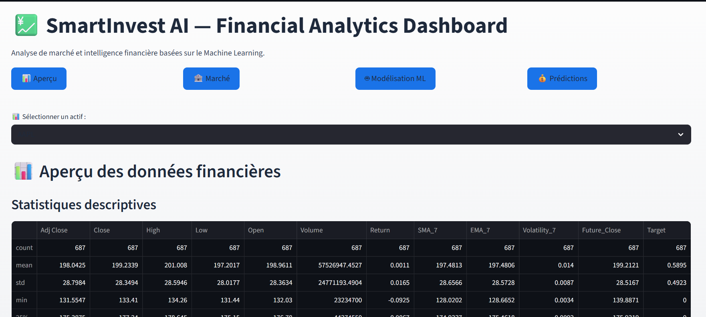
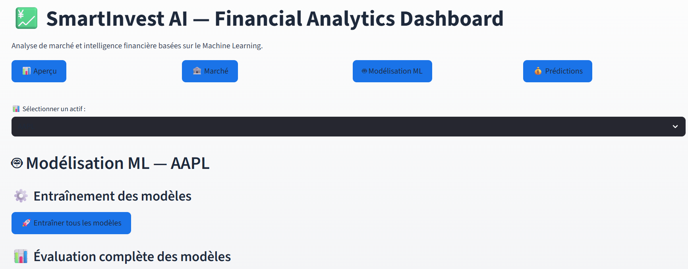

# 💼 SmartInvest AI – Financial Intelligence Dashboard

**SmartInvest AI** est une application interactive de dashboard financier basée sur le **Machine Learning**, permettant d’analyser les données financières, d’entraîner des modèles prédictifs et de fournir des conseils financiers personnalisés.

---

## 🔹 Fonctionnalités principales

### 1. Aperçu des données financières
- Statistiques descriptives
- Visualisations :
  - Histogrammes
  - Boxplots
  - Courbes temporelles

### 2. Analyse du marché
- Données récentes des prix
- Indicateurs clés :
  - Prix actuel
  - Rendement
  - Volatilité
- Statistiques générales (prix min/max)

### 3. Modélisation ML
- **Prétraitement des données** : normalisation, split train/test
- **Entraînement de modèles supervisés** :
  - Random Forest
  - Gradient Boosting
  - XGBoost
  - Logistic Regression
  - SVM
- **Évaluation des modèles** :
  - Accuracy, F1-score, Precision, Recall, ROC-AUC
  - Affichage comparatif des courbes ROC
  - Matrice de confusion pour le modèle choisi
  - Interprétation automatique des courbes ROC
  - Conseils pour ajuster les seuils de décision

### 4. Prédictions et conseils financiers
- Saisie des valeurs d’un actif
- Prédiction du mouvement du marché (hausse/baisse)
- Conseils personnalisés basés sur les valeurs saisies et le modèle
- Visualisation claire et design moderne

### 📊 Aperçu du dashboard

### 🤖 Modélisation ML

### 💰 Prédictions et conseils financiers

